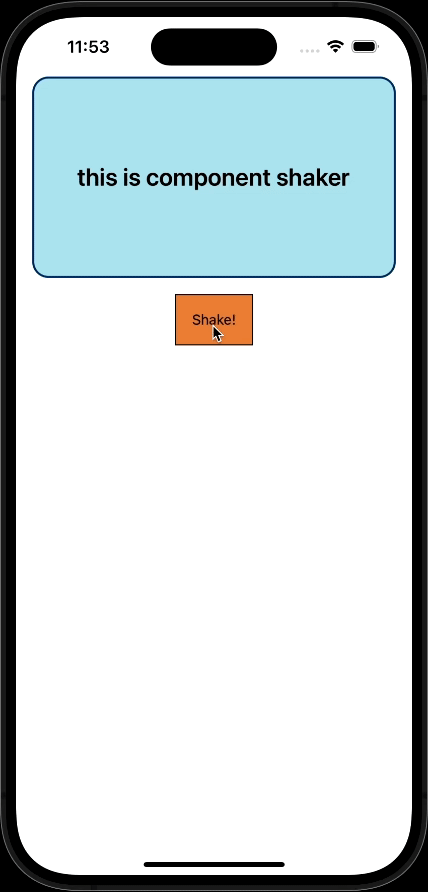
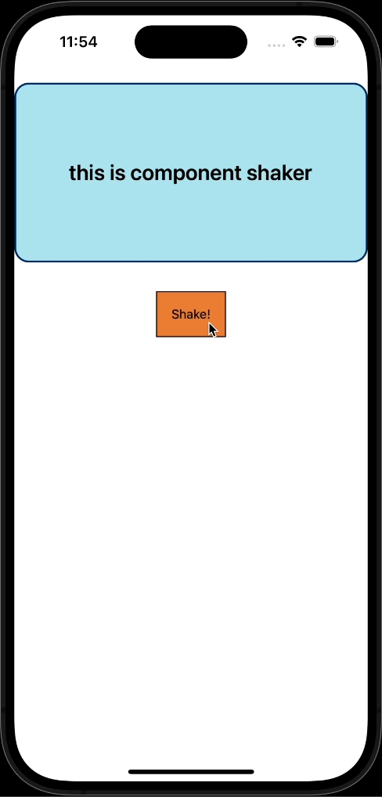
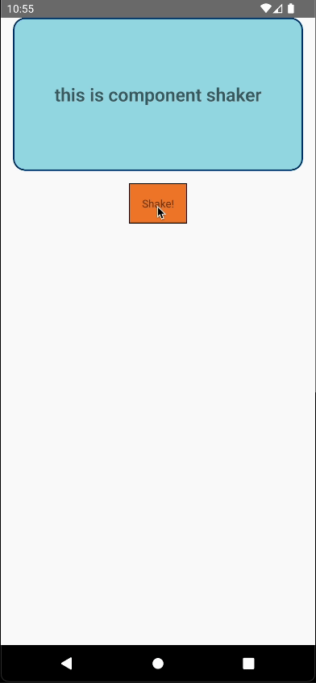
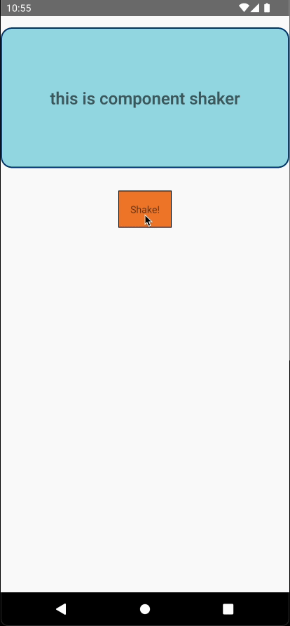

# react-native-component-shaker

A simple component for shaking component.  
It supports horizon, vertical shake.  
It has law dependency. (React, React Native)

<p align="center">
  
  
	
  
</p>

## Installation

npm

```bash
npm i react-native-component-shaker
```

yarn

```bash
yarn add react-native-component-shaker
```

## Properties

| props           | required | type                                  | description                                                                                                                                                           |
| :-------------- | :------: | :------------------------------------ | :-------------------------------------------------------------------------------------------------------------------------------------------------------------------- |
| shakeDirection  |    X     | shakeDirection("horizon", "vertical") | Shake direction.</br>You can select horizon or vertical.</br>`defafult: "horizon"`                                                                                    |
| shakeDistance   |    X     | number                                | Shake distance.</br>This prop work like padding.</br>`defafult: 16`                                                                                                   |
| shakeCount      |    X     | number                                | Shake count.</br>Decide how many moves to make to the left and right. Move by the number you enter+1, and the last move is to return to the center.</br>`defafult: 8` |
| shakeDuration   |    X     | number                                | Shake duration.</br>It's the time the animation is running. It's in milliseconds.</br>`defafult: 1000`                                                                |
| isShakeActivate |    O     | boolean                               | Animation start trigger.</br>When ture, the animation started.                                                                                                        |
| children        |    O     | JSX.Element, JSX.Element[]            | The React Native component used for shaking.                                                                                                                          |
| onShakeEnd      |    X     | () => void                            | It triggers when the animation finishes.                                                                                                                              |

## Example

```javascript
import React, { useState } from "react";
import {
    SafeAreaView,
    View,
    Text,
    TouchableOpacity,
    StyleSheet,
} from "react-native";
import ComponentShaker from "react-native-component-shaker";

const App = () => {
    const [isShaking, setIsShaking] = useState(false);

    return (
        <SafeAreaView>
            <ComponentShaker
                isShakeActivate={isShaking}
                onShakeEnd={() => setIsShaking(false)}
            >
                <View style={styles.shakeView}>
                    <Text style={styles.shakeFont}>
                        this is component shaker
                    </Text>
                </View>
            </ComponentShaker>

            <View style={styles.shakeButtonContainer}>
                <TouchableOpacity
                    style={styles.shakeButton}
                    onPress={() => setIsShaking(true)}
                >
                    <Text>Shake!</Text>
                </TouchableOpacity>
            </View>
        </SafeAreaView>
    );
};

export default App;

const styles = StyleSheet.create({
    shakeView: {
        alignItems: "center",
        justifyContent: "center",
        width: "100%",
        height: 200,
        borderWidth: 2,
        borderColor: "#063970",
        borderRadius: 16,
        backgroundColor: "#abdbe3",
    },
    shakeFont: {
        fontSize: 24,
        fontWeight: "600",
    },
    shakeButtonContainer: {
        alignItems: "center",
        width: "100%",
        padding: 16,
    },
    shakeButton: {
        alignItems: "center",
        justifyContent: "center",
        padding: 16,
        borderWidth: 1,
        backgroundColor: "#e28743",
    },
});
```
